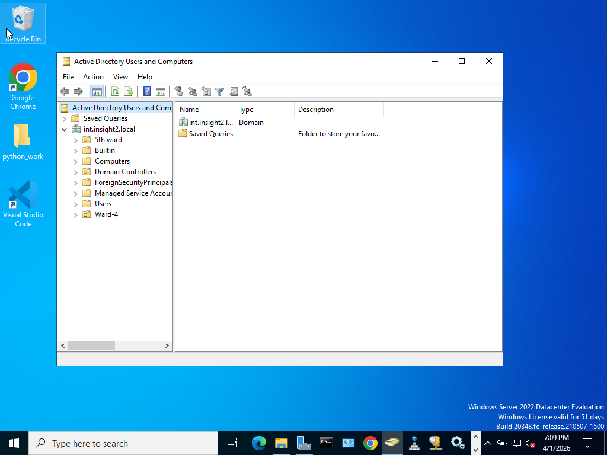
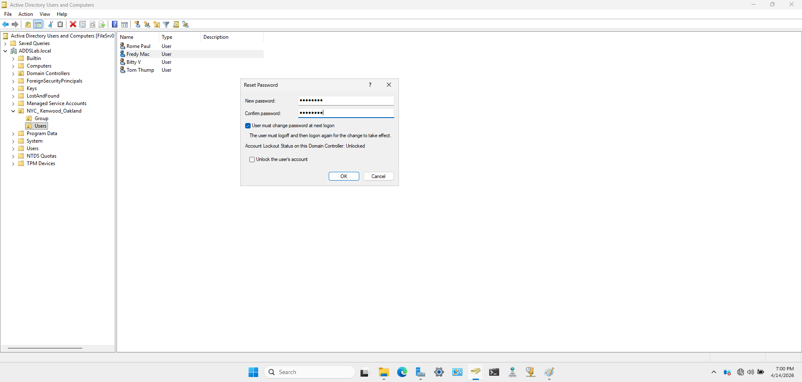

# Fred Davis

## IT Support Technician | Active Directory | Networking | CCNA | Security+

IT Support professional with 2+ years of experience supporting Windows environments, Active Directory user management, and network connectivity issues. 

Hands-on experience includes user account management, password resets, and troubleshooting Tier 1–2 incidents. GitHub projects demonstrate real-world IT support tasks and system administration skills.

## 📂 Projects
- Active Directory User Management Lab

## 📫 Connect with Me
- LinkedIn: https://www.linkedin.com/in/fred-davis2/
- GitHub: https://github.com/Active-Directory-Users-Management
## Active Directory User Management Lab

## 📫 Connect with Me
- LinkedIn: [Fred Davis](https://www.linkedin.com/in/fred-davis2/)
- GitHub: [fcsr7-IT](https://github.com/Active-Directory-Users-Management)

## Overview
This project demonstrates hands-on experience with Active Directory administration in a Windows Server environment, including user management, group policy, and access control.

## Key Skills
- Active Directory (Users, Groups, OUs)
- Group Policy (GPO)
- User Account Troubleshooting
- Access Control (RBAC)

## Technologies
- Windows Server 2022
- Active Directory Users & Computers (ADUC)
- Group Policy Management (GPMC)

## Project Highlights
- Created and managed users and groups  
- Configured Organizational Units (OUs)  
- Applied Group Policy settings  
- Resolved account lockouts and access issues  

## 📸 Screenshots

### Active Directory Structure

### Password Reset (User Support Task)

